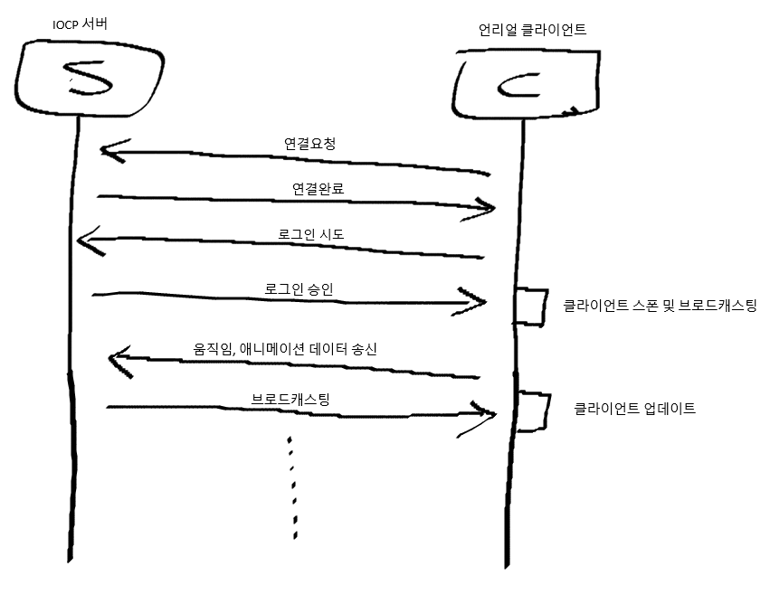

# IOCP_Demo
Windows 기반의 IOCP서버

제작 기간 : 2024-04-01 ~ 2024-04-15 (15일)  
영상 : https://youtu.be/1Cz-FqZi5eY  

## 동작 방식


서버는 클라이언트가 접속될 때까지 대기하고 클라가 접속을 하면 패킷타입에 맞게 데이터를 역직렬화 및 직렬화하여 재전송  
움직임, 애니메이션같은 데이터의 경우 모든 플레이어에게 브로드캐스팅  

## 서버 구조


AcceptThread는 클라의 접속을 담당하고 연결이 되었을 시에 클라에게 Conn패킷을 Proto로 직렬화하여 전송하는 역할  
WorkThread는 수신받은 클라의 데이터를 다른 클라이언트에게 역직렬화/직렬화하여 재전송하는 역할  
SendThread는 패킷을 하나의 클라이언트에게 송신하는 역할, 반면 SendBroadCastThread는 모든 클라이언트에게 송신하는 역할  
이때 Send과정은 모두 Queue자료구조를 통해서 순차적으로 송신됨  

## 패킷 코드

```
PacketFuncMap.emplace(EPacketType::Login_S, std::bind(&CIOCPServer::RecvLoginPacket, this, std::placeholders::_1, std::placeholders::_2));
PacketFuncMap.emplace(EPacketType::FireEvent_S, std::bind(&CIOCPServer::RecvFireEventPacket, this, std::placeholders::_1, std::placeholders::_2));
PacketFuncMap.emplace(EPacketType::Movement_S, std::bind(&CIOCPServer::RecvMovementPacket, this, std::placeholders::_1, std::placeholders::_2));
PacketFuncMap.emplace(EPacketType::AnimState_S, std::bind(&CIOCPServer::RecvAnimPacket, this, std::placeholders::_1, std::placeholders::_2));
PacketFuncMap.emplace(EPacketType::WeaponState_S, std::bind(&CIOCPServer::RecvWeaponPacket, this, std::placeholders::_1, std::placeholders::_2));
```
패킷을 전달받았을 때 알맞는 패킷 타입에 맞게 역직렬화를 수행해야 하므로 unordered_map자료구조를 이용하여 적절한 패킷 함수를 호출  
<br/><br/>
```
패킷 버퍼는 단순히 보낼 데이터를 담고있는 공간
struct PacketBuffer
{
    ... 중략
private:
	char* Buffer;
	UINT16 BufferPos = 0;
	UINT16 BufferSize = 0;
};

헤더는 패킷의 크기와 패킷의 종류를 담고있는 구조체
struct PacketHeader
{
	UINT16 PacketSize;
	UINT16 PacketID;
};

template<typename T>
PacketBuffer SerializePacket(T PPacket, UINT8 PType, UINT16 ClientIndex)
{
	// 헤더에 패킷타입과 헤더를 포함한 데이터의 총 크기를 저장
	PacketHeader Header;
	Header.PacketID = PType;
	Header.PacketSize = (UINT16)PPacket.ByteSizeLong() + sizeof(PacketHeader);

	// 패킷에 헤더 정보를 추가
	PacketBuffer PBuffer;
	PBuffer.SetIndex(ClientIndex);
	PBuffer.ReservePacket(Header.PacketSize);
	PBuffer.CopyPacket(&Header, sizeof(PacketHeader));

	PPacket.SerializeToArray(PBuffer.GetBuffer() + sizeof(PacketHeader), Header.PacketSize - sizeof(PacketHeader));
	// 복사할 데이터만큼 버퍼의 마지막 위치 이동
	PBuffer.IncBufferPos((UINT16)PPacket.ByteSizeLong());

	return PBuffer;
}
```
T는 Protobuf에서 만들어둔 message타입으로 SerializeToArray함수를 통해 Protobuf에서 셋팅해둔 값을 PacketBuffer로 직렬화
이때 헤더를 PacketBuffer에 미리 저장하고 그 다음공간에 proto데이터를 저장하는 이유는 이후 역직렬화과정에서 헤더를 통해 데이터를 효율적으로 읽어들이기 위함
<br/><br/>

```
void CIOCPServer::DeSerializePacket(EPacketType InPacketID, void* Data, UINT16 DataSize)
{
	auto it = PacketFuncMap.find(InPacketID);
	if (it != PacketFuncMap.end())
	{
		std::function<void(void*, UINT16)> Func = it->second;
		Func(Data, DataSize);
	}
	else
	{
		// Error!
	}
}
```
데이터를 수신받으면 패킷타입(ID)와 데이터, 데이터 크기를 PacketFuncMap에 적절히 전달하여 proto의 messasge타입에 맞는 적절한 Recv함수를 호출
<br/><br/>

## 한계점
- 서버에서 충돌, 레이캐스팅을 수행하기 위해서 언리얼 내부 코드가 필요했기에 충돌 및 피격 기능은 클라이언트에서 우선적으로 처리해야했었다.
- 일부 패킷이 전송 중 적은양의 데이터가 방대하게 밀려 들어오기때문에 수신측의 소켓버퍼가 가득차서 일부 데이터에 손실이 발생하여 중요한 패킷들이 누락되는 문제가 존재한다.(소켓 버퍼를 늘려줄 수 있지만 이 역시 일시적인 해결책에 불과하다.)
- RPC처럼 특정 함수를 호출하고 서버와 클라에게 각각 이벤트를 전달해주는 방식으로 동작하게 만들고 싶었지만 언리얼 내부 프레임워크와 C++의 구조적인 문제로 인해 서버의 설계구조를 쉽게 바꿀 수 없었다.

## 개선사항
- 패킷 누락없이 전송할 수 있는 방법 찾기
- 데이터를 지속적으로 보내기보다 외삽 방식을 이용하여 처리하기
- 충돌 및 레이캐스팅 로직을 서버에서 처리하기
